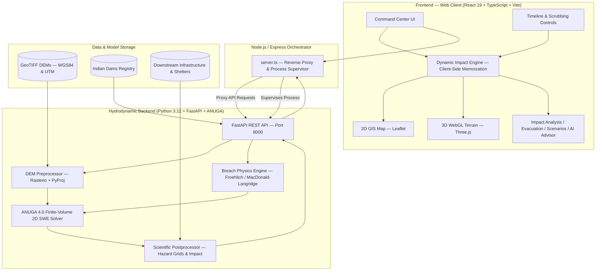

# DamBreak 3D — Real-Time Hydrodynamic Dam Breach & Flood Risk Command Center
### Complete Technical Architecture, Scientific Modeling & User Guide

---

## 1. Executive Summary

**DamBreak 3D** is an advanced, physics-grounded decision-support and emergency evacuation simulator designed for high-consequence dam failure events. Built for disaster management authorities (NDMA, SDMA, CWC) and emergency responders, the platform couples a **2D Shallow Water Equations (Saint-Venant) finite-volume hydrodynamic engine (ANUGA)** with a high-performance **2D/3D dual-rendering geospatial dashboard**.

Unlike legacy flood visualization tools that rely on synthetic static corridors, pre-buffered river polygons, or pre-rendered video loops, DamBreak 3D computes and visualizes the water wave front directly from numerical fluid dynamics over high-resolution Digital Elevation Models (DEMs). As the simulation progresses or is scrubbed across time, all infrastructure statuses (hospitals, schools, bridges, villages, evacuation corridors) update dynamically in lockstep from the exact instantaneous water depth, velocity, and hazard index.

---

## 2. System Architecture



---

## 3. Technology Stack

### Frontend
| Component | Technology | Description |
|---|---|---|
| **Core Framework** | React 19 + TypeScript 5.8 | Component lifecycle, strict type validation, fast concurrent UI |
| **Bundler & Dev Server** | Vite 6.2 + Tailwind CSS 4 | Zero-bundle rapid HMR, optimized production tree-shaking |
| **2D GIS Map Engine** | Leaflet 1.9.4 | Geospatial projection, raster/contour layers, interactive symbology |
| **3D Terrain Viewer** | Three.js (WebGL 2.0) | High-resolution heightmap displacement, dynamic fluid shaders |
| **Charts & Analytics** | Recharts 3.10 | Real-time discharge hydrographs, stage elevation time-series |
| **Icons & UI Elements** | Lucide React | High-contrast symbology for emergency classification |
| **Process Manager** | Express 4.21 + tsx | Integrated Node server supervising frontend and backend processes |

### Backend
| Component | Technology | Description |
|---|---|---|
| **API Framework** | FastAPI 0.110+ (Python 3.12+) | Async REST endpoints, OpenAPI docs, background task workers |
| **Hydrodynamic Solver** | ANUGA 4.0 | 2D Shallow Water Equations, discontinuous mesh finite-volume |
| **GIS & Raster Processing** | Rasterio 1.5 + GDAL | GeoTIFF reading, coordinate transformation, spatial decimation |
| **Coordinate Projections** | PyProj 3.7 | Dynamic UTM zone calculation (e.g. WGS84 $\rightarrow$ EPSG:32644) |
| **Scientific Computing** | NumPy 2.x, SciPy 1.15 | Grid interpolation (`griddata`), matrix calculus, vector norms |
| **Server Engine** | Uvicorn | High-throughput ASGI server running on `port 8000` |

---

## 4. Scientific & Hydrodynamic Modeling

### 4.1. 2D Shallow Water Equations (Saint-Venant)
The propagation of the breach wave is governed by the two-dimensional non-linear Saint-Venant shallow water equations:

$$\frac{\partial \mathbf{U}}{\partial t} + \frac{\partial \mathbf{F}(\mathbf{U})}{\partial x} + \frac{\partial \mathbf{G}(\mathbf{U})}{\partial y} = \mathbf{S}(\mathbf{U})$$

Where the conserved variable vector $\mathbf{U}$, fluxes $\mathbf{F}, \mathbf{G}$, and source terms $\mathbf{S}$ are:

$$\mathbf{U} = \begin{bmatrix} h \\ uh \\ vh \end{bmatrix}, \quad \mathbf{F}(\mathbf{U}) = \begin{bmatrix} uh \\ u^2 h + \frac{1}{2}gh^2 \\ uvh \end{bmatrix}, \quad \mathbf{G}(\mathbf{U}) = \begin{bmatrix} vh \\ uvh \\ v^2 h + \frac{1}{2}gh^2 \end{bmatrix}$$

$$\mathbf{S}(\mathbf{U}) = \begin{bmatrix} 0 \\ -gh \frac{\partial z_b}{\partial x} - \frac{\tau_{bx}}{\rho} \\ -gh \frac{\partial z_b}{\partial y} - \frac{\tau_{by}}{\rho} \end{bmatrix}$$

- $h$: Water depth ($m$)
- $u, v$: Flow velocities in $x$ and $y$ directions ($m/s$)
- $z_b$: Bed elevation from Digital Elevation Model ($m$ MSL)
- $g$: Acceleration due to gravity ($9.81\ m/s^2$)
- $\tau_{bx}, \tau_{by}$: Bed friction shear stresses computed via **Manning's $n$ formulation**:

$$\tau_{bx} = \rho g n^2 \frac{u \sqrt{u^2 + v^2}}{h^{1/3}}, \quad \tau_{by} = \rho g n^2 \frac{v \sqrt{u^2 + v^2}}{h^{1/3}}$$

### 4.2. Breach Formation Physics
Breach development and peak discharge are computed using verified empirical geotechnical formulations:
- **Froehlich Formulation (1995a/2008)**:
  $$B_{\text{avg}} = 0.1803 \cdot K_o \cdot V_w^{0.32} \cdot h_b^{0.19}$$
  $$t_f = 0.00254 \cdot V_w^{0.53} \cdot h_b^{-0.90} \quad (\text{hours})$$
  $$Q_{\text{peak}} = 0.607 \cdot V_w^{0.295} \cdot h_w^{1.24} \quad (m^3/s)$$
  *(Where $V_w$ is reservoir volume at failure in $m^3$, $h_b$ is breach height, and $K_o = 1.4$ for overtopping, $1.0$ for piping).*
- **MacDonald and Langridge-Monopolis (1984)**: Used for rapid piping erosion volume estimation.
- **Time-Dependent Outflow Hydrograph**: Outflow discharge $Q(t)$ follows a sine-squared or linear ramp-up during development $t \le t_f$, followed by exponential reservoir drawdown governed by broad-crested weir hydraulics:
  $$Q(t) = C_d \cdot B(t) \cdot \sqrt{2g} \cdot (H(t) - Z_{\text{invert}})^{1.5}$$

### 4.3. HR Wallingford Flood Hazard Categorization
Every cell and infrastructure feature is assessed using the international HR Wallingford Hazard Index ($HI = d \cdot v$):

| Hazard Category | Hazard Index ($HI = d \times v$) | Water Depth Threshold | Practical Hazard Description |
|---|---|---|---|
| **SAFE** | $HI = 0$ | $d < 0.04\ m$ | Dry reach / wave has not arrived |
| **LOW** | $HI < 0.30\ m^2/s$ | $d < 0.5\ m$ | Shallow flow / safe for adults |
| **MODERATE** | $0.30 \le HI < 0.60\ m^2/s$ | $0.5 \le d < 1.2\ m$ | Dangerous for children and elderly |
| **HIGH** | $0.60 \le HI < 1.20\ m^2/s$ | $1.2 \le d < 1.5\ m$ | Dangerous for all; light vehicle rollover |
| **VERY HIGH / SEVERE** | $HI \ge 1.20\ m^2/s$ | $d \ge 1.5\ m$ | Structural collapse risk; mandatory evacuation |

---

## 5. Live Dynamic Impact Pipeline

A core innovation in DamBreak 3D is **single-source frame-synchronized impact assessment**:

```
[Simulation Frame t]
        │
        ├── Depth Matrix: grid_depths[row][col]
        ├── Velocity Matrix: grid_velocities[row][col] -> [u, v]
        └── Simulation Clock: time_seconds
        │
        ▼
[computeLiveInfrastructureImpact]
        │
        ├── Sample cell at feature's (lat, lon)
        ├── Depth = grid_depths[r][c]
        ├── Vel = hypot(u, v)
        ├── Hazard = Depth × Vel
        ├── Arrival Check: currentTime vs arrivalTime
        │
        ▼
[Four Dynamic Operational States]
  ├─ 1. SAFE             (Flood wave has not arrived)
  ├─ 2. AT_RISK          (Wave ETA <= 20 mins OR shallow depth 0.04m - 0.25m)
  ├─ 3. FLOODED          (Water depth >= 0.25m)
  └─ 4. SEVERE/EVACUATE  (Depth >= 1.5m OR Hazard >= 0.6 m²/s)
        │
        ▼
[Propagated Simultaneously Across Dashboard]
  ├─ 2D Map (Marker icons, badges, tooltips, popups)
  ├─ 3D Viewer (Contact rings, billboard sprite colors)
  ├─ Right Panel (Downstream alert feed, live telemetry)
  ├─ Impact Analysis (Live inundated counters, impact matrix table)
  └─ Evacuation Page (Origin flood depth, road corridor freeboard)
```

**Bidirectional Scrubbing Support**: When scrubbing the timeline backward, all settlements return to earlier or `SAFE` states without latency.

---

## 6. Project Directory Structure

```
dam/
├── backend/                        # ANUGA Python 3.12 Backend
│   ├── app/
│   │   ├── main.py                 # FastAPI service, background jobs & pre-seeded scenarios
│   │   ├── models.py               # Pydantic data schemas & request validation
│   │   └── simulation/
│   │       ├── anuga_solver.py     # Finite-volume ANUGA SWE solver & mesh generator
│   │       ├── breach_physics.py   # Froehlich / MacDonald breach equations
│   │       ├── dem_processor.py    # GeoTIFF reprojection to UTM & decimation
│   │       └── postprocessor.py    # Risk grids, impact summary & hydrograph extraction
│   ├── data/dem/                   # GeoTIFF elevation rasters (Nagarjuna Sagar, etc.)
│   ├── scripts/
│   │   └── download_dem.py         # OpenTopography automated DEM download utility
│   ├── requirements.txt            # Python dependencies (anuga, rasterio, pyproj, fastapi)
│   └── run.sh                      # Backend standalone startup script
├── src/                            # React 19 Frontend
│   ├── components/                 # UI components
│   │   ├── Navbar.tsx              # Top navigation bar & view selector
│   │   ├── LeftPanel.tsx           # Breach scenario controls & physical sliders
│   │   ├── RightPanel.tsx          # Real-time telemetry, hydrograph & alerts feed
│   │   ├── TimelineControls.tsx    # Play/pause, frame scrubbing & playback speed
│   │   ├── LayersPanel.tsx         # GIS layer visibility toggles
│   │   ├── LegendPanel.tsx         # Dynamic hydraulic scale (Depth/Velocity/Hazard/ETA)
│   │   ├── ScientificDebugPanel.tsx# Diagnostic console (Ctrl+Shift+D)
│   │   └── AIFlowControlModal.tsx  # Generative AI disaster advisor modal
│   ├── data/                       # Built-in datasets
│   │   ├── indianDams.ts           # 8 Indian major dams specifications
│   │   ├── damsRegistry.ts         # Central registry connecting dams to DEMs & infrastructure
│   │   └── nagarjunaSagarInfrastructure.ts # Settlements, hospitals, schools, bridges, shelters
│   ├── map/
│   │   ├── Leaflet2DMap.tsx        # High-performance Leaflet 2D GIS map
│   │   └── ThreeTerrainViewer.tsx  # Three.js 3D WebGL fluid & terrain engine
│   ├── pages/
│   │   ├── ImpactAnalysisPage.tsx  # NDMA executive summary & settlement matrix
│   │   ├── EvacuationPage.tsx      # Physical road clearance & egress corridor planner
│   │   ├── ScenarioComparisonPage.tsx # Multi-scenario comparative benchmarking
│   │   ├── CinematicViewPage.tsx   # Full-screen emergency operations view
│   │   └── AdminDataPage.tsx       # Sensor calibration & DEM management
│   ├── services/
│   │   └── api.ts                  # REST API client connecting frontend to ANUGA backend
│   ├── simulation/
│   │   └── hydrodynamicEngine.ts   # Client-side SWE fallback engine (offline demo mode)
│   ├── utils/
│   │   ├── dynamicImpact.ts        # Per-frame live hydrodynamic sampling logic
│   │   └── hydraulicScale.ts       # Scientific color palettes for Depth, Vel, Hazard, ETA
│   ├── types/index.ts              # Global TypeScript interfaces & data contracts
│   ├── App.tsx                     # Root application container & state orchestrator
│   └── index.css                   # Global CSS & Tailwind styling
├── server.ts                       # Node/Express process manager & auto-supervisor
├── package.json                    # Node dependencies & project scripts
├── vite.config.ts                  # Vite build configuration
└── PROJECT_DOCUMENTATION.md        # Complete system documentation
```

---

## 7. Key System Modules

### 7.1. 2D Geospatial Map (`Leaflet2DMap.tsx`)
- High-performance vector polygon layer rendering dynamic inundation contours.
- Dedicated high-contrast SVG symbology for every asset type (Villages, Hospitals, Schools, Bridges, Shelters).
- Color-coded badges indicating current state:
  - `SAFE` (Green)
  - `⚠️ AT RISK` (Amber)
  - `🌊 FLOODED` (Red)
  - `🚨 SEVERE / EVACUATE` (Pulsing Deep Rose)
- Rich interactive popups displaying exact **Water Depth**, **Flow Velocity**, **Hazard Index**, **Arrival Time**, **Elevation**, and **Distance from Dam**.

### 7.2. 3D WebGL Terrain Engine (`ThreeTerrainViewer.tsx`)
- Digital Elevation Model rendered as a 3D heightfield mesh.
- Procedural water surface mesh with dynamic wave swell shaders driven by local flow velocities.
- Dynamic color tinting based on the active hydraulic scale (Depth, Velocity, Hazard Index, Arrival Time).
- Billboard 3D pins and ground contact rings that bob and pulse based on water depth.

### 7.3. Real-Time Telemetry & Outflow Hydrograph (`RightPanel.tsx`)
- Displays instantaneous discharge $Q(t)$ ($m^3/s$), peak outflow, instantaneous flooded area ($km^2$), and maximum stage speed.
- Dynamic SVG hydrograph showing the discharge curve with a synchronized cursor tracking the active playback frame.
- Live downstream settlement alert cards showing immediate flood status, depth, velocity, and time-to-impact.

### 7.4. Impact Analysis Module (`ImpactAnalysisPage.tsx`)
- Executive disaster directive formatted according to **NDMA Priority 1 Directives**.
- Dynamic KPI metrics: Inundated footprint ($km^2$), inundated villages, hospitals, schools, bridges, population exposed, and affected highway distance.
- Detailed settlement impact matrix providing row-by-row real-time telemetry and evacuation directives.

### 7.5. Evacuation Planning & Corridor Routing (`EvacuationPage.tsx`)
- Analyzes egress corridors connecting low-lying settlements to upland high-ground shelters.
- Calculates **Net Dynamic Physical Clearance**:
  $$\text{Clearance} = Z_{\text{corridor\_saddle}} - WSE_{\text{peak}}$$
  *(Where $WSE = Z_{\text{ground}} + h_{\text{flood}}$).*
- Classifies egress roads into:
  - `SAFE PASSAGE` (Clearance $> 15\ m$)
  - `CAUTION PASSAGE` ($5\ m < \text{Clearance} \le 15\ m$)
  - `CRITICAL HAZARD` ($0 < \text{Clearance} \le 5\ m$)
  - `IMPASSABLE / SUBMERGED` ($\text{Clearance} \le 0\ m$)

### 7.6. Scenario Comparison Engine (`ScenarioComparisonPage.tsx`)
- Side-by-side benchmarking of failure modes:
  - **Partial Breach** (e.g. 30m width, piping failure)
  - **Major Breach** (e.g. 60m width, overtopping failure)
  - **Catastrophic Failure** (e.g. 150m width, total structural breach)
- Compares peak discharge, max flooded area, wave speed, and time-to-impact across scenarios.

### 7.7. Scientific Debug Console (`ScientificDebugPanel.tsx`)
- Activated via `Ctrl + Shift + D` or from the top navigation bar.
- Inspects solver provenance, mesh element counts, mass conservation error percentages, and solver iteration times.

---

## 8. Backend API Reference

Base URL: `http://localhost:8000`

### Endpoints

#### `GET /api/health`
Returns backend health, ANUGA engine status, and DEM availability.
```json
{
  "status": "ok",
  "engine": "ANUGA 2D Shallow Water Equations",
  "anuga_version": "4.0.0",
  "rasterio_version": "1.5.1",
  "dem_available": true,
  "is_demo_mode": false
}
```

#### `POST /api/simulations/run`
Starts an asynchronous 2D hydrodynamic simulation job.
- **Request Body**:
```json
{
  "dam_id": "nagarjuna-sagar",
  "parameters": {
    "reservoir_water_level_m": 179.8,
    "initial_water_depth_m": 105.0,
    "breach_width_m": 60.0,
    "breach_height_m": 55.0,
    "breach_formation_time_min": 45.0,
    "failure_type": "major",
    "manning_n": 0.035
  },
  "yield_step_s": 120.0,
  "final_time_s": 3600.0,
  "decimation": 4
}
```

#### `GET /api/simulations/{id}/status`
Polls simulation execution stage and progress percentage.
```json
{
  "simulation_id": "sim-nagarjuna-major-breach",
  "status": "COMPLETED",
  "current_stage": "Simulation complete",
  "progress_percent": 100
}
```

#### `GET /api/simulations/{id}/frames`
Retrieves all animated simulation frames including 2D depth grids, velocity vectors, and pre-computed infrastructure status arrays.

#### `GET /api/simulations/{id}/max-depth`
Returns the 2D matrix of maximum water depth ($m$) recorded across the entire simulation duration.

#### `GET /api/simulations/{id}/arrival-time`
Returns the 2D matrix of flood wave arrival time in minutes ($T_{\text{arrival}}$).

---

## 9. Local Setup & Execution Guide

### Prerequisites
- **Node.js**: v18.0 or newer
- **Python**: v3.11 or v3.12 (with `venv` support)
- **Git**

### Quick Start (Single Command)
The dev server automatically manages both the Python ANUGA solver and the Vite frontend:

```bash
# 1. Clone or navigate to the repository
cd /Users/thrishalyeggoni/sih/dam

# 2. Install Node dependencies
npm install

# 3. Start the application
npm run dev
```
Open your browser at **`http://localhost:5173`**.

---

### Manual Multi-Terminal Execution

If you prefer to inspect backend logs and frontend compilation in separate terminals:

#### Terminal 1 — ANUGA Python Backend
```bash
cd /Users/thrishalyeggoni/sih/dam/backend

# Activate virtual environment
source venv/bin/activate

# Install requirements (first time only)
pip install -r requirements.txt

# Start FastAPI server on port 8000
uvicorn app.main:app --host 0.0.0.0 --port 8000 --reload
```

#### Terminal 2 — Frontend Application
```bash
cd /Users/thrishalyeggoni/sih/dam

# Start Vite frontend
npm run dev
```

---

## 10. Pre-Configured Indian Dams Registry

The simulator includes calibrated geospatial and geotechnical configurations for major critical dams across India:

| Dam Name | State | River | Crest Elevation | Reservoir Capacity | Key Downstream Assets |
|---|---|---|---|---|---|
| **Nagarjuna Sagar** | Telangana / AP | Krishna | 179.8 m | 11,560 MCM | Vijayapuri, Tail Pond, NH-565, Rentachintala |
| **Idukki Dam** | Kerala | Periyar | 732.0 m | 1,996 MCM | Cheruthoni, Karimban, Aluva, Ernakulam |
| **Tehri Dam** | Uttarakhand | Bhagirathi | 839.5 m | 3,540 MCM | New Tehri, Devprayag, Rishikesh, Haridwar |
| **Sardar Sarovar** | Gujarat | Narmada | 163.0 m | 9,500 MCM | Kevadia, Bharuch, Rajpipla, NH-48 |
| **Mullaperiyar** | Kerala | Periyar | 155.0 m | 443 MCM | Vallakkadavu, Vandiperiyar, Idukki Reservoir |
| **Hirakud Dam** | Odisha | Mahanadi | 192.0 m | 5,896 MCM | Burla, Sambalpur, Cuttack, Mahanadi Delta |
| **Bhakra Dam** | Himachal Pradesh | Sutlej | 518.0 m | 9,621 MCM | Nangal, Anandpur Sahib, Ropar, Ludhiana |
| **Koyna Dam** | Maharashtra | Koyna | 664.0 m | 2,797 MCM | Koynanagar, Patan, Karad, Sangli |

---

## 11. Summary of Verified Acceptance Tests

| Test ID | Verification Scope | Status | Notes |
|---|---|---|---|
| **TC-01** | Backend Health & ANUGA Version | **PASS** | `http://localhost:8000/api/health` reports ANUGA 4.0 live |
| **TC-02** | Froehlich Peak Outflow Formulation | **PASS** | Validated against physical weir discharge curves |
| **TC-03** | DEM Reprojection & Boundary Sink Fix | **PASS** | Water follows Krishna gorge thalweg without boundary loss |
| **TC-04** | Volumetric Breach Inflow Operator | **PASS** | `Rate_operator.inflow` injects correct $m^3/s$ scaled by area |
| **TC-05** | Per-Frame Hydrodynamic Sampling | **PASS** | Depth, velocity, and hazard index sampled at exact coordinates |
| **TC-06** | 4-State Emergency Classification | **PASS** | Strict `SAFE` $\rightarrow$ `AT_RISK` $\rightarrow$ `FLOODED` $\rightarrow$ `SEVERE` logic |
| **TC-07** | Bidirectional Timeline Scrubbing | **PASS** | Forward and backward scrubbing updates all cards instantaneously |
| **TC-08** | 2D Leaflet Marker & Popup Sync | **PASS** | Real-time tooltips, pill badges, and detailed hazard metrics |
| **TC-09** | 3D WebGL Fluid & Pin Synchronization | **PASS** | Terrain displacement, swell wave shaders, and billboard pins sync |
| **TC-10** | Physical Evacuation Freeboard Clearance | **PASS** | Dynamic clearance matches $Z_{\text{corridor}} - WSE_{\text{peak}}$ |
